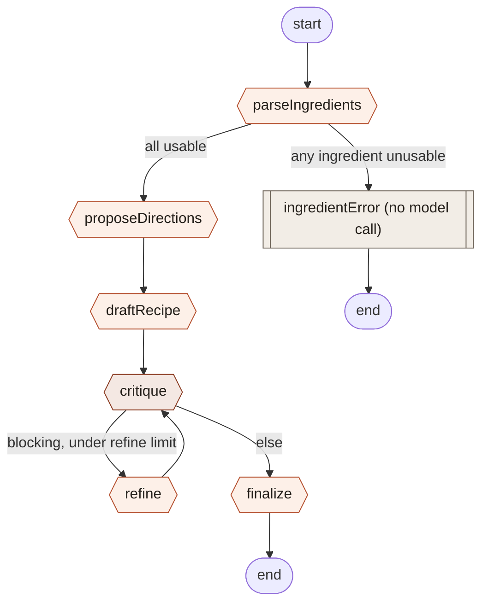

# Recipe Agent

Turn a list of ingredients into a finished recipe, one LangGraph stage at a
time — with full time-travel: every stage's output is a checkpoint you can
inspect, edit, and replay from.

Live spec/plan/task docs (the authoritative source for anything not covered
here) live under [specs/001-recipe-agent/](specs/001-recipe-agent/), governed
by [.specify/memory/constitution.md](.specify/memory/constitution.md). This
README is a reader's map to the crux of the app — the agent graph — not a
replacement for those.

## Stack

- **Next.js App Router**, deployed on Vercel — one route (`/`), no
  per-session URLs.
- **LangGraph.js** (`@langchain/langgraph`) runs the agent graph inside API
  route handlers; **`PostgresSaver`** (Neon) persists every stage as a
  checkpoint.
- **OpenRouter**, via `@langchain/openai`'s `ChatOpenAI` pointed at
  OpenRouter's endpoint — the only way any node talks to a model
  ([lib/agent/models.ts](lib/agent/models.ts)). No provider SDK is used
  directly.
- **Zod** validates every graph-state channel and every node's output.
- Sessions are **device-private**: an anonymous `clientId` in `localStorage`
  is the only credential (`X-Client-Id` header). Nothing is shareable across
  devices or people.

## Time-travel, in one paragraph

Every stage's output is a LangGraph checkpoint. Stepping through the graph
one stage at a time (or via Auto-run) walks that checkpoint chain forward.
Retrying a failed stage creates a sibling checkpoint in the same chain.
**Forking** — editing a past state and replaying from there — seeds a
*brand-new* LangGraph thread (one thread per branch), replaying the parent
branch's recorded stage outputs up to the fork point before diverging with
the edit. This design exists because of a confirmed data-loss bug in
`@langchain/langgraph-checkpoint-postgres` when branching within a single
thread — see [research.md § R3](specs/001-recipe-agent/research.md) for the
full writeup and [lib/fork-replay.ts](lib/fork-replay.ts) for the
implementation.

## The agent graph

This is the crux of the app: six real stages plus one terminal error stage,
wired up in [lib/agent/graph.ts](lib/agent/graph.ts). Every node validates
its input and output against a Zod schema
([lib/agent/state.ts](lib/agent/state.ts)); the graph is compiled with
`interruptAfter` on every node, so each API request advances exactly one
stage.



| Node | Model | Reads | Writes | Routes to |
|---|---|---|---|---|
| `parseIngredients` | `MODELS.default` | `ingredients` (raw), `constraints` | `ingredients` (classified) | `ingredientError` if any ingredient is unusable, else `proposeDirections` |
| `ingredientError` | — (no model call) | `ingredients` | `outcome: "ingredient-error"` | end |
| `proposeDirections` | `MODELS.default` | `ingredients`, `constraints` | `directions` (2–3) | `draftRecipe` |
| `draftRecipe` | `MODELS.default` | `ingredients`, `constraints`, `directions` | `recipeDraft` | `critique` |
| `critique` | `MODELS.critique` (stronger model) | `recipeDraft`, `constraints`, `critiques` | `critiques` (appended) | `refine` if the latest critique is blocking and under `MAX_REFINE_CYCLES`, else `finalize` |
| `refine` | `MODELS.default` | `recipeDraft`, latest `critique` | `recipeDraft`, `refineCount++` | `critique` |
| `finalize` | `MODELS.default` | `recipeDraft`, `constraints` | `finalRecipe`, `outcome: "finalized"` | end |

`MODELS.default` / `MODELS.critique` resolve from the `MODEL_DEFAULT` /
`MODEL_CRITIQUE` env vars ([lib/agent/models.ts](lib/agent/models.ts)) — swap
models by changing env vars, never code.

### The prompts

Exact templates from [lib/agent/prompts.ts](lib/agent/prompts.ts), in graph
order. Every one of these is sent through `withStructuredOutput` against a
Zod schema, so the model's reply is always validated shape before it's
trusted (constitution Principle II). A shared `constraintsBlock()` helper
renders cuisine/time/servings/diet constraints identically across all of
them; `"No constraints specified."` when none are set.

#### 1. `parseIngredients`

```
You are a culinary assistant. Classify each raw ingredient line a home
cook typed. For each, decide if it's usable to cook with, normalize its name
and quantity if possible, and flag whether it's a common pantry staple
(salt, oil, water, etc.).

Constraints:
<constraintsBlock>

Raw ingredient lines (one per item, preserve order):
<numbered list of each ingredient's raw text>

For each unusable item, set usable: false and reason to one of:
"not-food" (not an edible ingredient), "unintelligible" (can't tell what it is),
"duplicate" (repeats an earlier line), or "other".
```

#### 2. `proposeDirections`

```
Given these usable ingredients, propose 2-3 distinct dish directions
(different styles/cuisines/techniques) that make good use of them.

Constraints:
<constraintsBlock>

Usable ingredients:
<bulleted list: name (quantity)>

For each direction give a short title, a 1-2 sentence summary, and a brief
note on why it fits the ingredients and constraints.
```

#### 3. `draftRecipe`

```
Write a full recipe draft for this dish direction, using the
available ingredients.

Constraints:
<constraintsBlock>

Dish direction: <first direction's title> — <its summary>

Usable ingredients:
<bulleted list: name (quantity)>

Produce a title, a servings count, an ordered list of steps (each with an
estimated time in minutes where sensible, and a technique name if relevant),
and a "toBuy" list of anything needed but not among the ingredients above.
```

#### 4. `critique` (uses `MODELS.critique`)

```
Critique this recipe draft as an experienced chef. Judge whether the
steps are feasible as written, whether the flavors balance, and list anything
missing or unclear. Set blocking: true only if the recipe has a real problem
that must be fixed before it's servable (not just stylistic preference).

Constraints:
<constraintsBlock>

This is critique cycle <priorCritiques.length + 1>.

Recipe draft:
<recipeDraft as JSON>
```

#### 5. `refine`

```
Revise this recipe draft to address the critique below. Keep what
already works; only change what the critique calls out.

Recipe draft:
<recipeDraft as JSON>

Critique to address:
<latest critique as JSON>
```

#### 6. `finalize`

```
Finalize this recipe: scale it to the requested servings (if given),
polish the wording, and produce an approximate nutrition estimate per serving
(calories, protein, carbs, fat). Nutrition figures are estimates, not lab
measurements.

Constraints:
<constraintsBlock>

Recipe draft:
<recipeDraft as JSON>
```

## Local development

```bash
cp .env.example .env   # fill in DATABASE_URL (Neon, pooled) and OPENROUTER_API_KEY
npm install
npm run migrate        # creates LangGraph's checkpoint tables + app tables
npm run dev
```

Other scripts: `npm test` (Vitest, most tests run against a real Postgres
wire protocol via PGlite — no live database needed), `npm run test:e2e`
(Playwright), `npm run lint`, `npm run build`.

See [specs/001-recipe-agent/quickstart.md](specs/001-recipe-agent/quickstart.md)
for the fuller walkthrough — every env var explained, and manual test
scenarios for each limit/failure path.

## Deploy

This is built for Vercel + Neon:

1. Create a Neon Postgres project; grab the **pooled** connection string
   (hostname has `-pooler` in it — required for serverless).
2. Import the repo into a new Vercel project (Next.js is auto-detected).
3. Set every env var from [.env.example](.env.example) in the Vercel
   project's settings — at minimum `DATABASE_URL`, `OPENROUTER_API_KEY`,
   `MODEL_DEFAULT`, `MODEL_CRITIQUE`, `PUBLIC_URL` (your deployed URL),
   `CRON_SECRET` (any random string — Vercel Cron sends it back as
   `Authorization: Bearer $CRON_SECRET`, which `/api/cron/purge` checks).
4. Deploy. The build runs `npm run vercel-build`
   ([package.json](package.json)), which applies `scripts/migrate.ts`
   (idempotent — creates LangGraph's checkpoint tables and the app's own
   tables) before `next build`, so migrations never need a separate manual
   step.
5. `vercel.json` already wires up the daily purge cron
   (`/api/cron/purge`, `SESSION_PURGE_DAYS`-based retention) — nothing else
   to configure.

## Where to look next

- [specs/001-recipe-agent/spec.md](specs/001-recipe-agent/spec.md) — full
  functional requirements and user stories.
- [specs/001-recipe-agent/data-model.md](specs/001-recipe-agent/data-model.md)
  — every graph-state channel and app database table.
- [specs/001-recipe-agent/contracts/api.md](specs/001-recipe-agent/contracts/api.md)
  — the API routes' request/response contracts.
- [specs/001-recipe-agent/research.md](specs/001-recipe-agent/research.md) —
  the design decisions behind the trickier parts (time-travel, rate limits,
  cancellation, save-failure recovery).
- [specs/001-recipe-agent/tasks.md](specs/001-recipe-agent/tasks.md) — current
  implementation progress, task by task.
